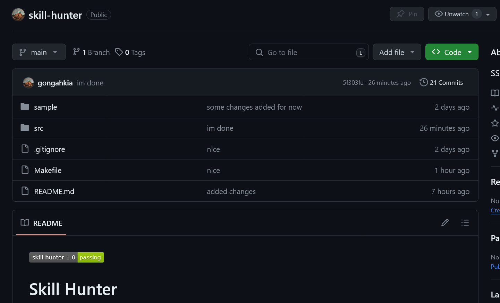
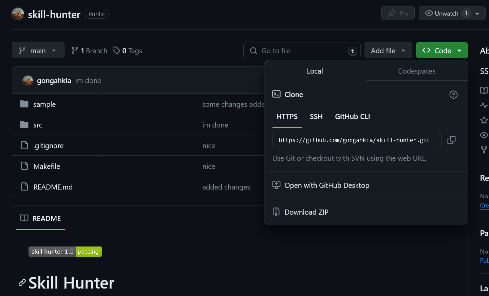

[](https://github.com/gongahkia/skill-hunter/releases/tag/1.0)[]()

# Skill Hunter

Browser extension that formats legislation to be more readable.

## Motivation

[SSO](https://sso.agc.gov.sg/) is the most-referenced source for lawyers when keeping up to date with Singapore Legislation.

Time is often spent poring over definitions and navigating between interpretation and offence sections.

`Skill Hunter` simplifies the heavily-nested DOM structure of the webpage to one that is intuitive and easily understood by lawyers and programmers alike.

## Purpose

* BLUF, offence sections and their limbs are laid bare
* Important terms are defined in place
* Browser extension with tiny source code binary
* Supported on Firefox and Chrome

## Screenshots


## Installation

### CLI

```console
$ git clone https://github.com/gongahkia/skill-hunter
$ cd skill-hunter
$ make
```

### GUI

1. Click *Code*.



2. Click *Download ZIP*.



3. Unzip the ZIP file.

## Usage

### Firefox

1. Copy and paste this link in the search bar *about:debugging#/runtime/this-firefox*.
2. Click *load temporary add-on*.
3. Open the `skill-hunter` repo, select `manifest.json`.
4. Open any **SSO** page, then click *Whole Document*.
5. Click the toggle button.

### Chrome

1. Copy and paste this link in the search bar *chrome://extensions/*.
2. Toggle *Developer mode* on.
3. Click *load unpacked*.
4. Open the `skill-hunter` repo, click *select*.
5. Open any **SSO** page, then click *Whole Document*.
6. Click the toggle button.

## Browser support

Support for browsers like Opera, Vivaldi have not been extensively tested, but should work while support for Manifest V2 persists. [Open an issue](https://github.com/gongahkia/skill-hunter/issues) for further support.

## References

The name `Skill Hunter` is in reference to the Nen ability of [Chrollo Lucilfer](https://hunterxhunter.fandom.com/wiki/Chrollo_Lucilfer) (クロロ＝ルシルフル), the founder and leader of the Phantom Troupe in the ongoing manga series, [HunterXhunter](https://hunterxhunter.fandom.com/wiki/Hunterpedia).


