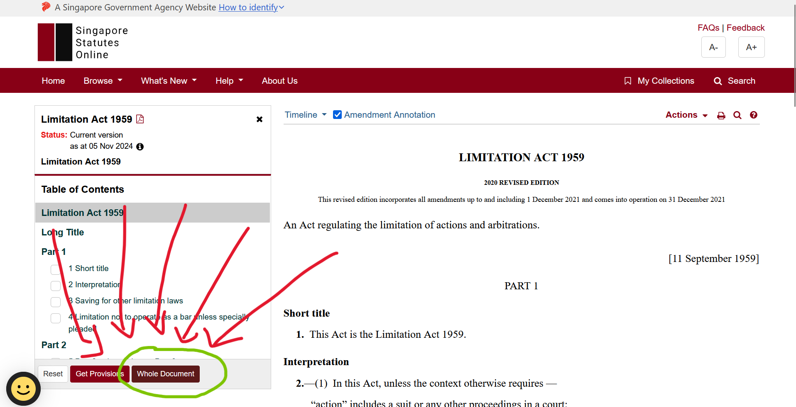

[](https://github.com/gongahkia/skill-hunter/releases/tag/1.0) [](https://github.com/gongahkia/skill-hunter/releases/tag/2.0) [](https://github.com/gongahkia/skill-hunter/releases/tag/3.0)

# Skill Hunter

<p align="center">

</p>

[Monorepo](#skills) for legal workflow tools.

## Skills

* Root (`/`) `Skill Hunter` browser extension for readable Singapore legislation on SSO

## Motivation

[SSO](https://sso.agc.gov.sg/) is the most-referenced source for lawyers when keeping up to date with Singapore Legislation.

Time is often spent poring over definitions and navigating between interpretation and offence sections.

`Skill Hunter` simplifies the heavily-nested DOM structure of the webpage to one that is intuitive and easily understood by lawyers and programmers alike.

`legal-tech-thing` extends this repository into a full contract-ingestion and review stack (web, extension, desktop, API, workers), so one repo now contains two legal-productivity "skills" with different use cases.


* `skills/legal-tech-thing/` multi-app contract review platform
* Keep the extension lightweight while enabling deeper contract review workflows in the second skill
* Preserve full commit history for both projects in a single repository

## Screenshot


## Stack

* *Skill Hunter (root extension)*: [TypeScript](https://www.typescriptlang.org/), [HTML5](https://developer.mozilla.org/en-US/docs/Web/HTML), [CSS3](https://developer.mozilla.org/en-US/docs/Web/CSS), [Webpack](https://webpack.js.org/), [Jest](https://jestjs.io/), [npm](https://www.npmjs.com/)
* *Legal Tech Thing (`skills/legal-tech-thing`)*: [TypeScript](https://www.typescriptlang.org/), [Fastify](https://fastify.dev/), [Next.js](https://nextjs.org/), [Electron](https://www.electronjs.org/), [Prisma](https://www.prisma.io/), [BullMQ](https://docs.bullmq.io/), [Redis](https://redis.io/), [PostgreSQL](https://www.postgresql.org/), [pnpm](https://pnpm.io/), [Turborepo](https://turbo.build/repo)
* *Code Quality*: [ESLint](https://eslint.org/), [Prettier](https://prettier.io/)

## Supported browsers

Find `Skill Hunter` on the [Chrome Web Store](https://chromewebstore.google.com) or [Firefox browser Add-ons](https://addons.mozilla.org/en-US/firefox/).

| Browser | Status | Link |
| :--- | :--- | :--- | 
| Google Chrome |  | ... | 
| Firefox |  | [addons.mozilla.org/en-US/firefox/addon/skill-hunter/](https://addons.mozilla.org/en-US/firefox/addon/skill-hunter/) |
| Safari |  | NIL | 

## [Presentation](./asset/presentation/class_part.pdf)

## Installation

Build the monorepo locally.

### CLI

```console
$ git clone https://github.com/gongahkia/skill-hunter
$ cd skill-hunter
$ npm install
$ make
$ cd skills/legal-tech-thing
$ pnpm install
$ pnpm build
```

### GUI

1. Click *Code*.


2. Click *Download ZIP*.


3. Unzip the ZIP file.

## Usage

### Repository layout

1. Root (`skill-hunter/`): original `Skill Hunter` browser extension.
2. `skills/legal-tech-thing/`: legal-tech contract review stack (web + extension + desktop + API + workers).

### Skill Hunter extension

### Chrome

1. Copy and paste this link in the search bar *chrome://extensions/*.
2. Toggle *Developer mode* on.
3. Click *load unpacked*.
4. Open the `skill-hunter` repo, click *select*.
5. Open any **SSO** page, then click *Whole Document*.



6. Click the simplify button.

### Firefox

1. Copy and paste this link in the search bar *about:debugging#/runtime/this-firefox*.
2. Click *load temporary add-on*.
3. Open the `skill-hunter` repo, select `manifest.json`.
4. Open any **SSO** page, then click *Whole Document*.


5. Click the simplify button.

### Legal Tech Thing skill

1. `cd skills/legal-tech-thing`
2. Start full local stack with `pnpm dev`.
3. Build all workspaces with `pnpm build`.
4. Run API tests from `services/api` with `pnpm --filter @legal-tech/api test` (after building test artifacts).

## Browser support

Support for browsers like Opera, Vivaldi have not been extensively tested for the extension, but should work while support for Manifest V3 persists. [Open an issue](https://github.com/gongahkia/skill-hunter/issues) for further support.

## References

The name `Skill Hunter` is in reference to the Nen ability of [Chrollo Lucilfer](https://hunterxhunter.fandom.com/wiki/Chrollo_Lucilfer) (クロロ＝ルシルフル), the founder and leader of the Phantom Troupe in the ongoing manga series, [HunterXhunter](https://hunterxhunter.fandom.com/wiki/Hunterpedia).


